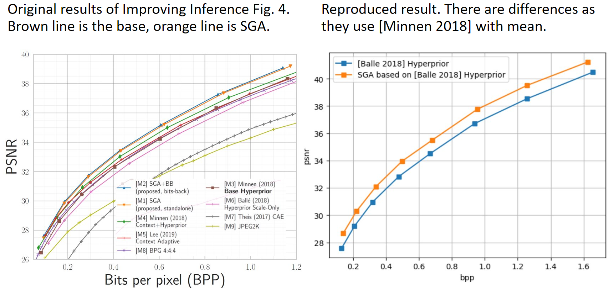

## Pytorch implementation of *Improving Inference for Neural Image Compression*
* This is an unoffical pytorch implementation of Improving Inference for Neural Image Compression
* Original tensorflow implementation: https://github.com/mandt-lab/improving-inference-for-neural-image-compression
* This repo is based on CompressAI: https://github.com/InterDigitalInc/CompressAI/tree/master/compressai
* Citation: if you find this repo helpful for you research, please cite this repo alone with original paper.

## Prerequisites
* packages: pytorch + torchvision, compressai, numpy
* pre-trained models:
    * We use [Balle 2018] hyperprior as base model, so the following compressAI pretrain model should be downloaded:
    ```bash
    wget https://compressai.s3.amazonaws.com/models/v1/bmshj2018-hyperprior-1-7eb97409.pth.tar
    wget https://compressai.s3.amazonaws.com/models/v1/bmshj2018-hyperprior-2-93677231.pth.tar
    wget https://compressai.s3.amazonaws.com/models/v1/bmshj2018-hyperprior-3-6d87be32.pth.tar
    wget https://compressai.s3.amazonaws.com/models/v1/bmshj2018-hyperprior-4-de1b779c.pth.tar
    wget https://compressai.s3.amazonaws.com/models/v1/bmshj2018-hyperprior-5-f8b614e1.pth.tar
    wget https://compressai.s3.amazonaws.com/models/v1/bmshj2018-hyperprior-6-1ab9c41e.pth.tar
    wget https://compressai.s3.amazonaws.com/models/v1/bmshj2018-hyperprior-7-3804dcbd.pth.tar
    wget https://compressai.s3.amazonaws.com/models/v1/bmshj2018-hyperprior-8-a583f0cf.pth.tar
    ```
* dataset:
    * We use Kodak dataset with 24 images: https://r0k.us/graphics/kodak/, so the dataset should be downloaded

## Reproduce the result in Improving Inference for Neural Image Compression
* Note: this repo does not contains bits-back coding part, only the stochastic gumbel annealing with [Balle 2018] hyperprior as baseline is implemented. This repo can be trivially extended into [Cheng 2020] by extending the ScaleHyperpriorSGA class in net.py.
* To run the stochastic gumbel annealing part, simplely use:
    ```bash
    python main.py -q $QUALITY -mr $MODEL_FOLDER -dr $KODAK_FOLDER
    ```
    * QUALITY is a variable in compressAI model, use 0,...,7 to control the target bpp
    * MODEL_FOLDER is the path to folder where you put the model
    * KODAK_FOLDER is the path to folder where you put Kodak dataset
* The result are pretty close to the original paper:
* 

